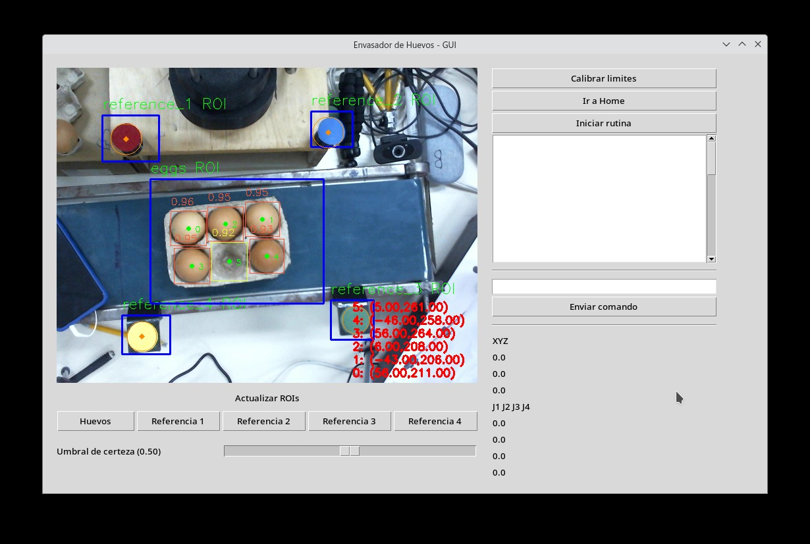

# Egg supplier with Computer Vision and Scara Robotic Arm

## Roboflow Server (self hosted on same machine)

Run commands as root if necessary.

- Create docker container from image. Requires internet connecion for the first time processing images:

    ```bash
    docker run -d --name roboflow-server -p 8080:9001 roboflow/roboflow-inference-server-cpu
    ```

- Stop container:

    ```bash
    docker stop roboflow-server
    ```

- Start again container (at this point internet connection is no longer necessary for processing images):

    ```bash
    docker start roboflow-server
    ```

- Monitor stdout and stderr:

    ```bash
    docker attach roboflow-server
    ```

## GUI and main program

Modify `video_source` and `robot_port` if necessary.

```bash
python3 main.py
```



Here's a [working video demo](./demos/scara-cv-egg-supplier.mp4)